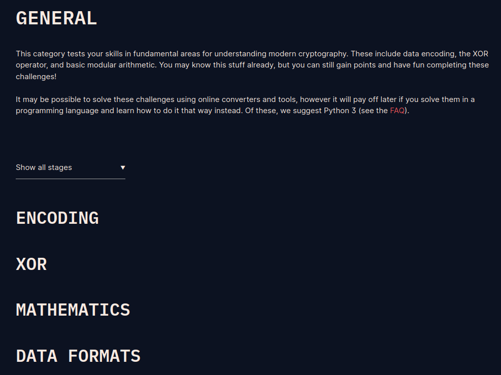

# CryptoHack Solutions for Marlon Marishta B00156808
## Description
This repository contains my solutions to Cryptohack challenges, organized by the challenge sections I attempted from the Cryptohack website (https://cryptohack.org/challenges/).

Each challenge section has its own directory, and within those directories, you'll find subdirectories corresponding to specific subsections on the Cryptohack website. For example, the "General" section contains 4 sub-sections, as shown on the website.

The scripts for completing the challenges are located within their respective directories, and each script is named after the challenge. For some challenges, I used additional tools such as Wireshark or online utilities. In these cases, I have provided screenshots of my work, named after the corresponding challenge. If a challenge required both a script and another tool, you will find both a script and a screenshot with the same name.
